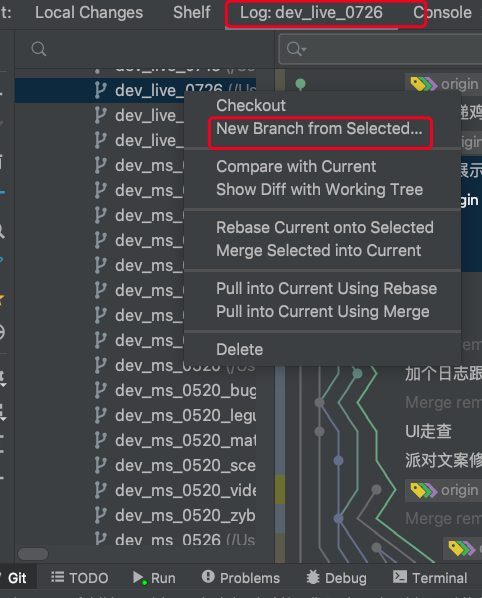
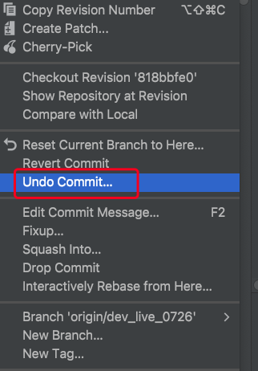

##### 

### 3、选中远程分支-创建分支（未push前为local型）

##### 通过AS选中远程分支，右击，选择new Branch from selected，并创建输入想要创建的分支，该分支为本地的，想要push后才会同步到git仓库。

##### 再选中新创建的分支，push到远程

### 撤销Android studio 提交到git远程后撤销

##### 1、使用undo Commit，本地修改内容仍然存在，变更为未提交状态，git log change提交记录也会一并撤销，相当于整个没有提交。

##### 但是如果重新pull代码，本地未commit或者push，本地undo Commit代码会被pull回来的代码覆盖掉

##### 2、使用Revert Commit 提交后撤销，本地提交前的修改内容不存在已被撤销，git log  提交记录存在。

##### 3、想提交到A分支，最后提交到B分支，可使用Cherry Pick切换到A分支

##### 
