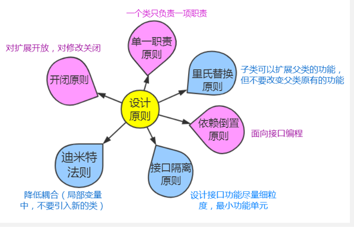

我们在分析和使用设计模式的时候，经常会混淆适配器模式、装饰模式、代理模式、外观模式，因为它们实在是太像了。

我们应该如何区分呢？

别急，只要我们记住它们的主要特征就非常很简单了！

#### 代理模式

代理者和被代理者都必须实现同一个接口，并且代理者必须持有被代理者的对象。

#### 装饰模式

原有类不能满足需求时，对原有类进行增强。装饰模式一定是从外部传入，通常是将原始对象作为参数传递给装饰者的构造器。

#### 适配器模式

通常因为接口不兼容而需要适配器进行适配。

#### 外观模式

定义：提供了一个统一的接口，用来访问子系统中的一群接口，外观定义了一个高层接口，让子系统更容易使用。

#### 总结

代理模式注重的是隔离限制，控制对原有对象的访问。

装饰模式注重的是功能的扩展，关注于在一个对象上动态的添加方法，在同一个方法下实现更多的功能。

适配器模式注重的是接口的兼容。

外观模式注重的是多个类的集成、统一适配。

[原文：再也不用为分辨适配器模式、装饰模式、代理模式、外观模式犯愁了！](https://blog.csdn.net/u011578734/article/details/113745223)