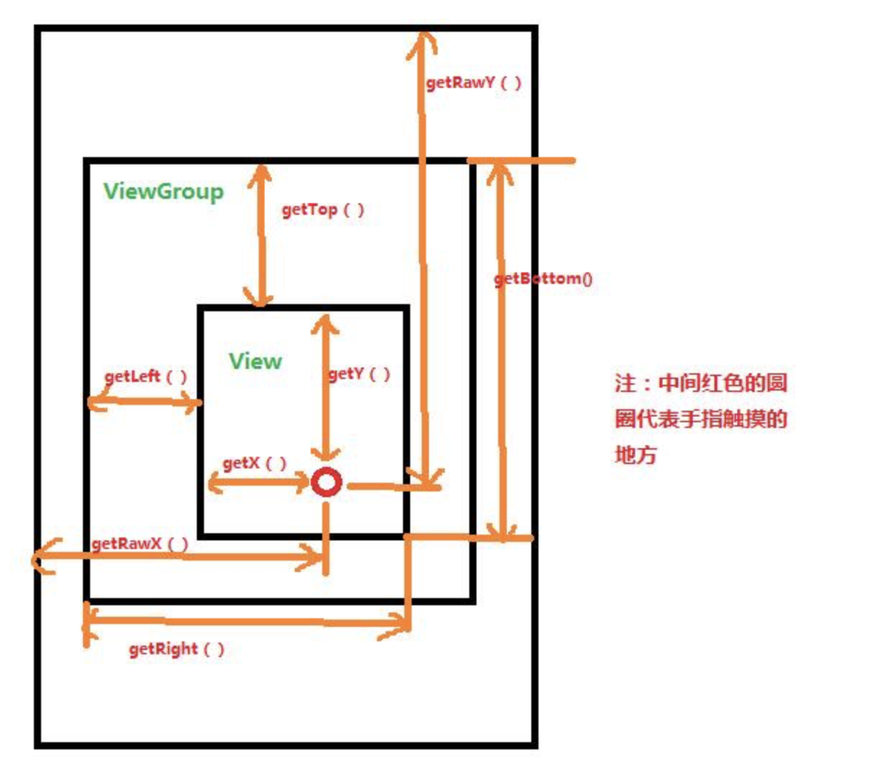
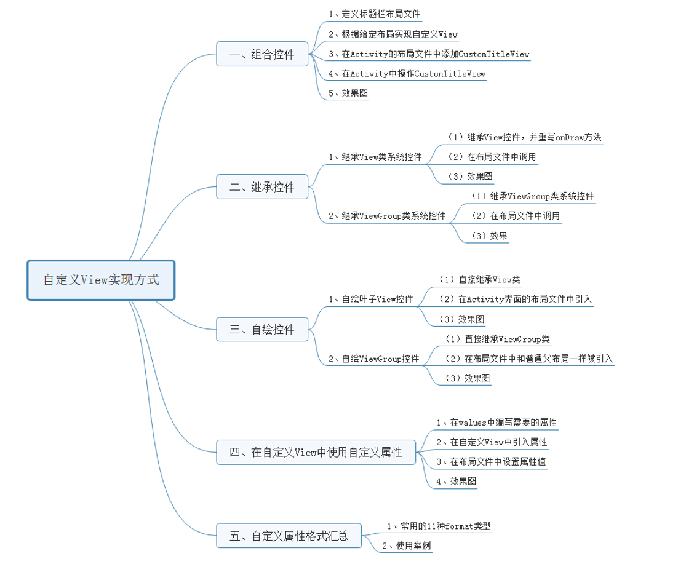

# 自定义View基础

# 分类

* 自定义组合控件

* 自定义view:分为继承系统view，比如TextView，和直接继承view类

* 自定义ViewGroup:分为继承系统ViewGroup比如LinearLayout。和直接继承ViewGroup

#  View的绘制流程

## View的绘制基本由measure()、layout()、draw()这个三个函数完成


- measure（）：测量View的宽高，相关方法：measure()，setMeasuredDimension()，onMeasure()
- layout（）     ：计算当前View以及子View的位置

|    函数     | 作用                         | 相关方法                                       |
| :---------: | ---------------------------- | ---------------------------------------------- |
| measure（） | 测量View的宽高               | measure()，setMeasuredDimension()，onMeasure() |
| layout（）  | 计算当前View以及子View的位置 | layout(),onLayout(),setFrame()                 |
|   draw()    | 视图的绘制工作               | draw(),onDraw()                                |


## View获取自身高度

由上图可算出View的高度：

- width = getRight() -  getLeft();
- height  =  getBottom()  -  getTop();

View的源码当中提供了getWidth()和getHeight()方法用来获取View的宽度和高度，其内部方法和上文所示是相同的，我们可以直接调用来获取View得宽高。

## View自身的坐标

通过如下方法可以获取View到其父控件的距离。

- getTop()；获取View到其父布局顶边的距离。
- getLeft()；获取View到其父布局左边的距离。
- getBottom()；获取View到其父布局顶边的距离。
- getRight()；获取View到其父布局左边的距离。

## 构造函数

```java
public class TestView extends View {
    /**
     * 在java代码里new的时候会用到
     * @param context
     */
    public TestView(Context context) {
        super(context);
    }

    /**
     * 在xml布局文件中使用时自动调用
     * @param context
     */
    public TestView(Context context, @Nullable AttributeSet attrs) {
        super(context, attrs);
    }

    /**
     * 不会自动调用，如果有默认style时，在第二个构造函数中调用
     * @param context
     * @param attrs
     * @param defStyleAttr
     */
    public TestView(Context context, @Nullable AttributeSet attrs, int defStyleAttr) {
        super(context, attrs, defStyleAttr);
    }


    /**
     * 只有在API版本>21时才会用到
     * 不会自动调用，如果有默认style时，在第二个构造函数中调用
     * @param context
     * @param attrs
     * @param defStyleAttr
     * @param defStyleRes
     */
    @RequiresApi(api = Build.VERSION_CODES.LOLLIPOP)
    public TestView(Context context, @Nullable AttributeSet attrs, int defStyleAttr, int defStyleRes) {
        super(context, attrs, defStyleAttr, defStyleRes);
    }
}
```

## 自定义属性

* 自定义一个View

* 编写values/attrs.xml，在其中编写styleable和item等标签元素

* 在布局文件中View使用自定义的属性（注意namespace）

* 在View的构造方法中通过TypedArray获取

## 实例说明：

### 1、自定义属性的声明文件attr

```xml
    <?xml version="1.0" encoding="utf-8"?>
    <resources>
        <declare-styleable name="test">
            <attr name="text" format="string" />
            <attr name="testAttr" format="integer" />
        </declare-styleable>
    </resources>
```

### 2、自定义View中的使用

```java
public class MyTextView extends View {
    private static final String TAG = MyTextView.class.getSimpleName();

    //在View的构造方法中通过TypedArray获取
    public MyTextView(Context context, AttributeSet attrs) {
        super(context, attrs);
        TypedArray ta = context.obtainStyledAttributes(attrs, R.styleable.test);
        String text = ta.getString(R.styleable.test_testAttr);
        int textAttr = ta.getInteger(R.styleable.test_text, -1);
        Log.e(TAG, "text = " + text + " , textAttr = " + textAttr);
        ta.recycle();
    }
}
```

### 3、布局中使用

```java
<RelativeLayout xmlns:android="http://schemas.android.com/apk/res/android"
    xmlns:tools="http://schemas.android.com/tools"
    xmlns:app="http://schemas.android.com/apk/res/com.example.test"
    android:layout_width="match_parent"
    android:layout_height="match_parent" >

    <com.example.test.MyTextView
        android:layout_width="100dp"
        android:layout_height="200dp"
        app:testAttr="520"
        app:text="helloworld" />

</RelativeLayout>
```


## 属性值类型format

### reference资源ID引用、color颜色值、boolean布尔值、dimension尺寸值、 float浮点值、integer整型值、string字符串、fraction百分数、enum枚举值、flag位或运算

### (1). reference：参考某一资源ID自定义属性和属性使用

```xml
<declare-styleable name = "名称">
     <attr name = "background" format = "reference" />
</declare-styleable>

<ImageView android:background = "@drawable/图片ID"/>
```

### (2). color：颜色值

```xml
<attr name = "textColor" format = "color" />

<TextView android:textColor = "#00FF00" />
```

### (3). boolean：布尔值

```xml
<attr name = "focusable" format = "boolean" />

<Button android:focusable = "true"/>
```

### (4). dimension：尺寸值

```xml
<attr name = "layout_width" format = "dimension" />

<Button android:layout_width = "42dip"/>

```

### (5). float：浮点值

```xml
<attr name = "fromAlpha" format = "float" />

<alpha android:fromAlpha = "1.0"/>
```

### (6). integer：整型值

```xml
<attr name = "framesCount" format="integer" />

<animated-rotate android:framesCount = "12"/>
```

### (7). string：字符串

```xml
<attr name = "text" format = "string" />

<TextView android:text = "我是文本"/>
```

### (8). fraction：百分数

```xml
<attr name = "pivotX" format = "fraction" />

<rotate android:pivotX = "200%"/>
```

### (9). enum：枚举值

注意：枚举类型的属性在使用的过程中只能同时使用其中一个，不能

` android:orientation = "horizontal｜vertical"` 错误

```xml
<declare-styleable name="名称">
    <attr name="orientation">
        <enum name="horizontal" value="0" />
        <enum name="vertical" value="1" />
    </attr>
</declare-styleable>

<LinearLayout  
    android:orientation = "vertical">
</LinearLayout>
```

### (10). flag：位或运算

注意：位运算类型的属性在使用的过程中可以使用多个值

```xml
<declare-styleable name="名称">
    <attr name="gravity">
            <flag name="top" value="0x01" />
            <flag name="bottom" value="0x02" />
            <flag name="left" value="0x04" />
            <flag name="right" value="0x08" />
            <flag name="center_vertical" value="0x16" />
            ...
    </attr>
</declare-styleable>

<TextView android:gravity="bottom|left"/>
```

### (11). 混合类型：属性定义时可以指定多种类型值

```xml
<declare-styleable name = "名称">
     <attr name = "background" format = "reference|color" />
</declare-styleable>

<ImageView android:background = "@drawable/图片ID" />
或者：
<ImageView android:background = "#00FF00" />

```

## onMeasure过程

```java
    // 获取测量模式（Mode）
    int specMode = MeasureSpec.getMode(measureSpec)

    // 获取测量大小（Size）
    int specSize = MeasureSpec.getSize(measureSpec)

    // 通过Mode 和 Size 生成新的SpecMode
    int measureSpec=MeasureSpec.makeMeasureSpec(size, mode);

```


## 自定义ViewGroup的onMeasure流程（）比如LinearLayout/AbsoluteLayout

* 继承ViewGroup的情况复写onMeasure和onLayout方法。其中onMeasure（）方法会调用ViewGroup类的measureChidren（）方法，该方法会循环遍历所有的字view，调用measureChild（）方法。

* measureChidren（）方法会传递父容器的int parentWidthMeasureSpec，parentHeightMeasureSpec给到measureChild（）进行测量模式大小。

* child子view会拿到LayoutParams的参数，结合parentWidthMeasureSpec，parentHeightMeasureSpec给到getChildMeasureSpec（）。计算出子view的int childWidthMeasureSpec、childHeightMeasureSpec。

* child子view在拿到自己的childWidthMeasureSpec，childHeightMeasureSpec测量模式进行measure（）。在measure（）中会调用MeasureSpec.adjust（方法）makeMeasureSpec（）计算子widthMeasureSpec，heightMeasureSpec。将替换之前测的旧的值。在将模式存储到集合mMeasureCache中。
* 也就是说上述过程的measureChidren（）方法会将子view的测量模式根据位运算，将其存储到mMeasureCache缓存中。
* 接下来回到自定义ViewGroup中onMeasure（）方法继续往下走，会看到继续遍历childview。会通过LayoutParams拿到宽高，该宽高包含了padding上下左右值和Margin上下左右值。再将这个值传到setMeasuredDimension（）中。
* 在调用setMeasuredDimension（）之前，会根据前面获得的测量模式+state传递给到resolveSizeAndState（），根据测量模式和状态，MeasureSpec.AT_MOST/EXACTLY/UNSPECIFIED得到宽高的measuredWidth、measuredHeight，看他的orentation是vertical还是horizontal。
* setMeasuredDimension最终获得mMeasuredWidth，mMeasuredHeight

总结大体就是：onMeasure-》measureChidren[]循环遍历->measureChild->getChildMeasureSpec/makeMeasureSpec（知道宽高用MeasureSpec.EXACTLY）拿到Spec->measure-measure从mMeasureCache中去查询，不存在则继续onMeasure并setMeasuredDimension得到宽高。存在则直接设置setMeasuredDimension>最后得到宽高调用mMeasureCache.put（宽高）

```java
public static int getChildMeasureSpec(int spec, int padding, int childDimension) {
        int specMode = MeasureSpec.getMode(spec);
        int specSize = MeasureSpec.getSize(spec);

        int size = Math.max(0, specSize - padding);

        int resultSize = 0;
        int resultMode = 0;

        switch (specMode) {
        //当父View要求一个精确值时，为子View赋值
        case MeasureSpec.EXACTLY:
            //如果子view有自己的尺寸，则使用自己的尺寸
            if (childDimension >= 0) {
                resultSize = childDimension;
                resultMode = MeasureSpec.EXACTLY;
                //当子View是match_parent,将父View的大小赋值给子View
            } else if (childDimension == LayoutParams.MATCH_PARENT) {
                resultSize = size;
                resultMode = MeasureSpec.EXACTLY;
                //如果子View是wrap_content，设置子View的最大尺寸为父View
            } else if (childDimension == LayoutParams.WRAP_CONTENT) {
                resultSize = size;
                resultMode = MeasureSpec.AT_MOST;
            }
            break;

        // 父布局给子View了一个最大界限
        case MeasureSpec.AT_MOST:
            if (childDimension >= 0) {
                //如果子view有自己的尺寸，则使用自己的尺寸
                resultSize = childDimension;
                resultMode = MeasureSpec.EXACTLY;
            } else if (childDimension == LayoutParams.MATCH_PARENT) {
                // 父View的尺寸为子View的最大尺寸
                resultSize = size;
                resultMode = MeasureSpec.AT_MOST;
            } else if (childDimension == LayoutParams.WRAP_CONTENT) {
                //父View的尺寸为子View的最大尺寸
                resultSize = size;
                resultMode = MeasureSpec.AT_MOST;
            }
            break;

        // 父布局对子View没有做任何限制
        case MeasureSpec.UNSPECIFIED:
            if (childDimension >= 0) {
            //如果子view有自己的尺寸，则使用自己的尺寸
                resultSize = childDimension;
                resultMode = MeasureSpec.EXACTLY;
            } else if (childDimension == LayoutParams.MATCH_PARENT) {
                //因父布局没有对子View做出限制，当子View为MATCH_PARENT时则大小为0
                resultSize = View.sUseZeroUnspecifiedMeasureSpec ? 0 : size;
                resultMode = MeasureSpec.UNSPECIFIED;
            } else if (childDimension == LayoutParams.WRAP_CONTENT) {
                //因父布局没有对子View做出限制，当子View为WRAP_CONTENT时则大小为0
                resultSize = View.sUseZeroUnspecifiedMeasureSpec ? 0 : size;
                resultMode = MeasureSpec.UNSPECIFIED;
            }
            break;
        }
    
        return MeasureSpec.makeMeasureSpec(resultSize, resultMode);
    }
```


## onLayout过程

onLayout（）方法也会循环遍历所有的子view，调用layout（）方法摆放位置。

onLayout过程


