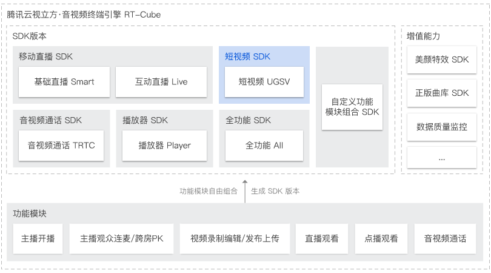
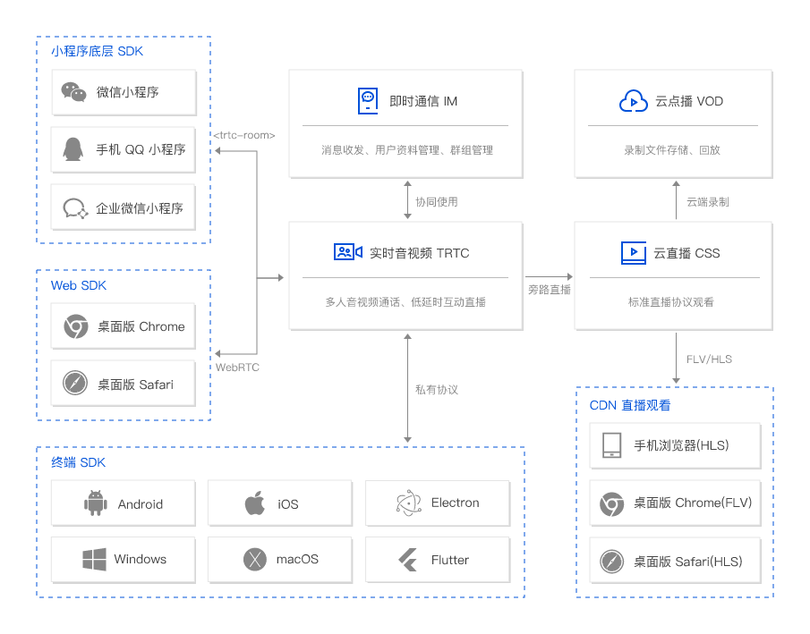

### 短视频

直播：视频源是正在推流的主播

点播：视频源是服务器已经存在的视频文件

RTC：实时音视频 Real-Time Communication，RTC

TRTC：腾讯实时音视频（Tencent Real-Time Communication，TRTC）

IM：通信 

CSS：云直播 

VOD：云点播 

### 短视频

### 名词介绍

### 短视频

### 推送

推送指用户将本地的音视频数据上传给 TRTC 服务端的操作，对应“推流”。

### 订阅

订阅指用户向 TRTC 服务端请求拉取指定用户音视频数据的操作，对应“拉流”。

### SDKAppID

SDKAppID（应用标识/应用 ID）是腾讯云后台用来区分不同 TRTC 应用的唯一标识，在 [TRTC 控制台](https://console.cloud.tencent.com/trtc/app) 创建应用时自动生成。不同 SDKAppID 之间的数据不互通。

### UserID

UserID（用户标识）用于在一个 TRTC 应用中唯一标识一个用户。

### 房间

房间是一个音视频空间，同一房间内的用户可以互相接收对方的实时音视频数据。

- TRTC 使用房间这个虚拟的概念，用于用户之间的相互隔离。
- 只有在同一个房间里的用户才可以相互接收音视频。
- 一个用户同一时间只能在一个房间内。如果要进入另一个房间，必须从前一个房间内退出。

