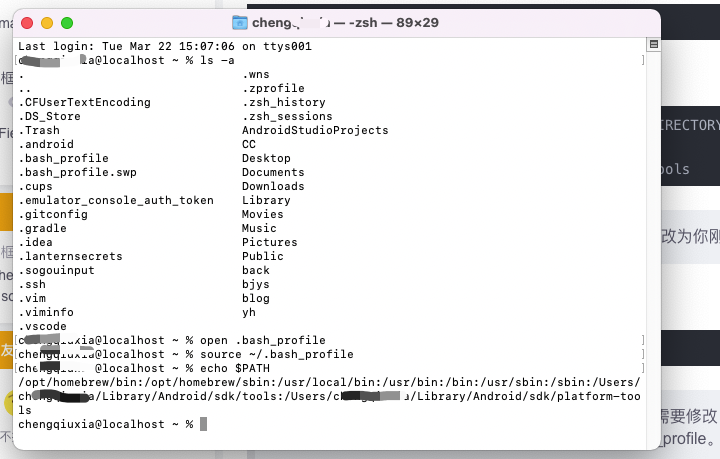
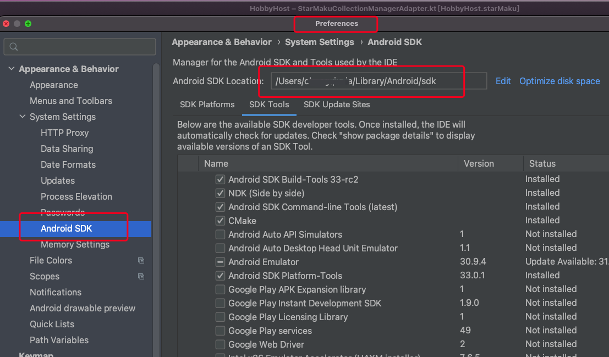

##### 通过shit+alt+.打开个人目录下的隐藏文件，可以查看到隐藏的.bash_profile和.zprofile等文件

##### 通过在termial.app中输入命令open .zprofile或者 open .bash_profile能打开该文件或者open -e .bash_profile也能打开编辑	


##### 通过在terminal.app中输入 ls -a能查看所有的目录文件，包含了隐藏文件，查看`.bash_profile`文件是否存在

##### 如果不存在，则执行：touch ~/.bash_profile相当于创建该.bash_profile文件

##### 如果存在，则执行：$ open ~/.bash_profile，打开该文件

##### 在打开的文件中输入如下内容：注：将其中的 `[PATH_TO_ANDROID_SDK_DIRECTORY]` 更改为你刚刚获取到的路径。

```shell
export ANDROID_HOME=[PATH_TO_ANDROID_SDK_DIRECTORY]
export PATH=$PATH:$ANDROID_HOME/tools
export PATH=$PATH:$ANDROID_HOME/platform-tools

export ANDROID_HOME=/Users/cheng/Library/Android/sdk
export PATH=$PATH:$ANDROID_HOME/tools
export PATH=$PATH:$ANDROID_HOME/platform-tools
```

##### 在终端terminal.app输入以下内容，使配置生效：$ source ~/.bash_profile

##### 在终端输入以下内容，查看环境变量：echo $PATH


##### 通过SDK Manager或者Preference或者Project Structure能查看到SDK路径

`/Users/username/Library/Android/sdk`

ds


```
/opt/homebrew/bin:/opt/homebrew/sbin:/usr/local/bin:/usr/bin:/bin:/usr/sbin:/sbin:/Users/cheng/Library/Android/sdk/tools:/Users/cheng/Library/Android/sdk/platform-tools
```


##### [Mac安装Android Studio并配置环境变量](https://blog.csdn.net/legolas_gd/article/details/106569571)



##### 第一步：vim .bash_profile

##### 第二步：填入环境，保存退出，esc键， 加 ：键 wq!

##### 第三步：source .bash_profile  查看 echo $PATH

##### 第四步 执行下列命令

##### 	touch .zshrc

##### 	open -e .zshrc

##### 输入：source  ~/.bash_profile ，然后按键盘 command + s 保存，关闭就可以了

##### 第五步：使环境变量生效 输入：source .zshrc


**查看zsh的相关文档发现，zsh其实并不使用 /etc/profile文件，而是使用 `/etc/zsh/` 下面的 `zshenv`、`zprofile`、`zshrc`、`zlogin` 文件，并以这个顺序进行加载。**

.bash_profile 中修改环境变量只对当前窗口有效，而且需要 source ~/.bash_profile才能使用
.zshrc 则相当于 windows 的开机启动的环境变量
你也可以在 .zshrc 文件中加一行 source .bash_profile 解决需要 source 才能使用的问题


##### zsh下的用户环境配置文件包括.zshenv、.zprofile、.zshrc、.zlogin、和.zlogout。（经查阅，有.zprofile文件，没有看到别的）

🍀使用场景
☘️.zshenv
.zshenv中存放的环境变量配置项在任何场景下都能被读取，这里通常把$PATH等变量写在这里，这样无论是在交互shell，或者运行程序都会读取此文件

☘️.zshrc
.zshrc主要用在交互shell，上篇文章中就是对这个文件进行修改。对终端交互shell有用。

☘️.zlogin
.zlogin则在login shell的时候读取，比如系统启动的时候会读取此文件

☘️.zprofile
.zprofile是.zlogin的替代品，如果使用了.zlogin就不必再关心此文件

☘️.zlogout
.zlogout退出终端的时候读取，用于做一些清理工作

🍀读取顺序
.zshenv → [.zprofile if login] → [.zshrc if interactive] → [.zlogin if login] → [.zlogout sometimes].

##### ############################# 配置 HomeBrew ####################################

  export HOMEBREW_BOTTLE_DOMAIN=https://mirrors.ustc.edu.cn/homebrew-bottles/bottles #ckbrew
  eval $(/opt/homebrew/bin/brew shellenv) #ckbrew

#####   ############################# 配置 Java ####################################

  #export JAVA_HOME=/Users/xingxiaole/Library/Java/JavaVirtualMachines/zulu-8.jdk/Contents/Home
  export JAVA_HOME=/Library/Java/JavaVirtualMachines/zulu-11.jdk/Contents/Home

#####   ############################# 配置 sdk ####################################

  export ANDROID_HOME=/Users/xingxiaole/Library/Android/sdk
  export PATH=${PATH}:${ANDROID_HOME}/platform-tools
  export PATH=${PATH}:${ANDROID_HOME}/tools

#####   ############################# 配置 gradle ####################################

  export GRADLE_HOME=/Users/xingxiaole/local/gradle-6.6.1
  export PATH=${PATH}:${GRADLE_HOME}/bin

  ##### 配置 NDK 环境变量  /Users/xingxiaole/Library/Android/sdk/ndk/22.1.7171670

  ##export NDK_HOME=/Users/xingxiaole/Library/Android/sdk/ndk-bundle
  export NDK_HOME=/Users/xingxiaole/Library/Android/sdk/ndk/17.2.4988734
  export PATH=${PATH}:${NDK_HOME}

